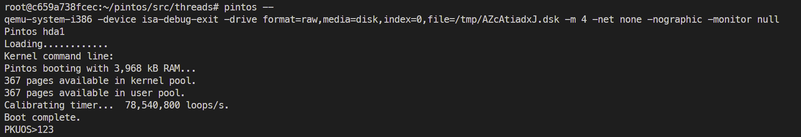
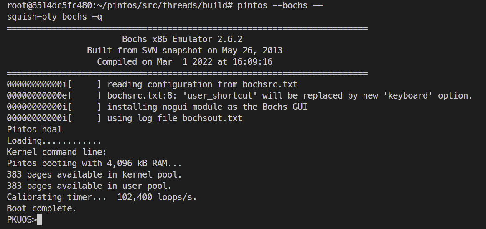
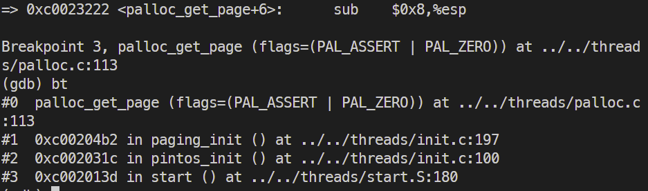
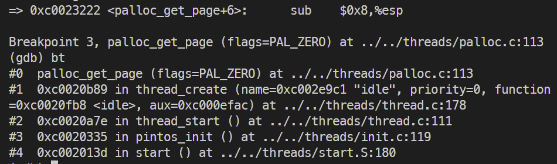
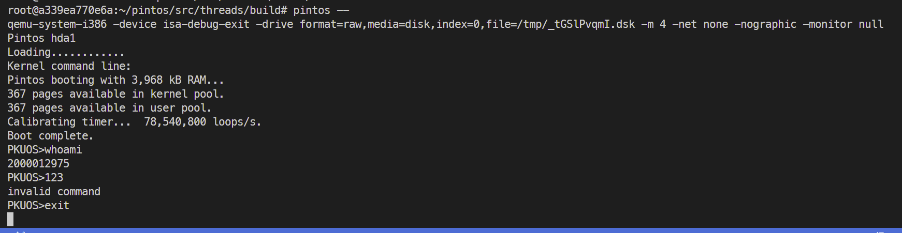

# Project 0: Getting Real

## Preliminaries

>Fill in your name and email address.

Haoran Geng <2000012975@stu.pku.edu.cn>

>If you have any preliminary comments on your submission, notes for the TAs, please give them here.

>Please cite any offline or online sources you consulted while preparing your submission, other than the Pintos documentation, course text, lecture notes, and course staff.

https://en.wikipedia.org/wiki/INT_13H

## Booting Pintos

>A1: Put the screenshot of Pintos running example here.

In QEMU:

In BOCHS

## Debugging

#### QUESTIONS: BIOS 

>B1: What is the first instruction that gets executed?

[f000:fff0]    0xffff0: ljmp   $0x3630,$0xf000e05b

>B2: At which physical address is this instruction located?

physical address: 0x0000fff0

#### QUESTIONS: BOOTLOADER

>B3: How does the bootloader read disk sectors? In particular, what BIOS interrupt is used?

use `call read_sector` -> `read_sector` to read disk sectors and use `42h` of `BIOS interrupt call` to execute the `Extended Read Sectors`

>B4: How does the bootloader decides whether it successfully finds the Pintos kernel?

1. in `read_mbr` function: first check for `MBR signature` (`cmpw $0xaa55, %es:510`), if not present, it's not a partitioned hard disk (then next drive). If exist: move to `Offset of partition table entry 1`

2. check partition: check if it is an unused partition (`cmpl $0, %es:(%si)`)
0: unused, then next section

3. check whether it is a Pintos kernel partition (`cmpb $0x20, %es:4(%si)`)
if not: not a Pintos kernel partition, then next partition

4. check whether it is a bootable partition (`cmpb $0x80, %es:(%si)`)
if so, load kernel!

>B5: What happens when the bootloader could not find the Pintos kernel?

if didn't find a Pintos kernel partition anywhere, go to `no_boot_partition`, output `"Not found"` and interrupt with code 0x18 (`int $0x18`), which is `Execute Cassette BASIC`

>B6: At what point and how exactly does the bootloader transfer control to the Pintos kernel?

execute start function (`ljmp *start`) to transfer control to the Pintos kernel: 

1. after read content with looping each sector, save in the memory of 0x2
000 (`mov $0x2000, %ax`)

2. Read the start address out of the ELF header (saved in 0x18 ) read and save to %dx (`mov %es:0x18, %dx`) and then save to start position in memory (`mov %dx, start`) (The 80x86 doesn't
have an instruction to jump to an absolute segment:offset kept in
registers, so in fact we store the address in a temporary memory
location, then jump indirectly through that location.)

3. finally transfer control to the Pintos kernel through ljmp (`ljmp *start`)

#### QUESTIONS: KERNEL

>B7: At the entry of pintos_init(), what is the value of expression `init_page_dir[pd_no(ptov(0))]` in hexadecimal format?

the value of expression `init_page_dir[pd_no(ptov(0))]` is **0**

>B8: When `palloc_get_page()` is called for the first time,

>> B8.1 what does the call stack look like?
>>
>> 

>> B8.2 what is the return value in hexadecimal format?
>>
>> (void *) 0xc0101000

>> B8.3 what is the value of expression `init_page_dir[pd_no(ptov(0))]` in hexadecimal format?
>>
>> 0x0

>B9: When palloc_get_page() is called for the third time,

>> B9.1 what does the call stack look like?
>>
>> 

>> B9.2 what is the return value in hexadecimal format?
>>
>> (void *) 0xc0103000

>> B9.3 what is the value of expression `init_page_dir[pd_no(ptov(0))]` in hexadecimal format?
>>
>> 0x102027

## Kernel Monitor

>C1: Put the screenshot of your kernel monitor running example here. (It should show how your kernel shell respond to `whoami`, `exit`, and `other input`.)

#### 

>C2: Explain how you read and write to the console for the kernel monitor.

First use while loop waiting for the input command, first print "PKUOS>" and initialize a buffer for current input command line. Then another while loop waiting for each char input and save to buffer until `'\n'` or `'\r'` happens. After the input finished, we check whether the string in buffer is some special strins like `"whoami"` or `"exit"`, and implement the requirement for each possible inputs and output the corresponding strings.