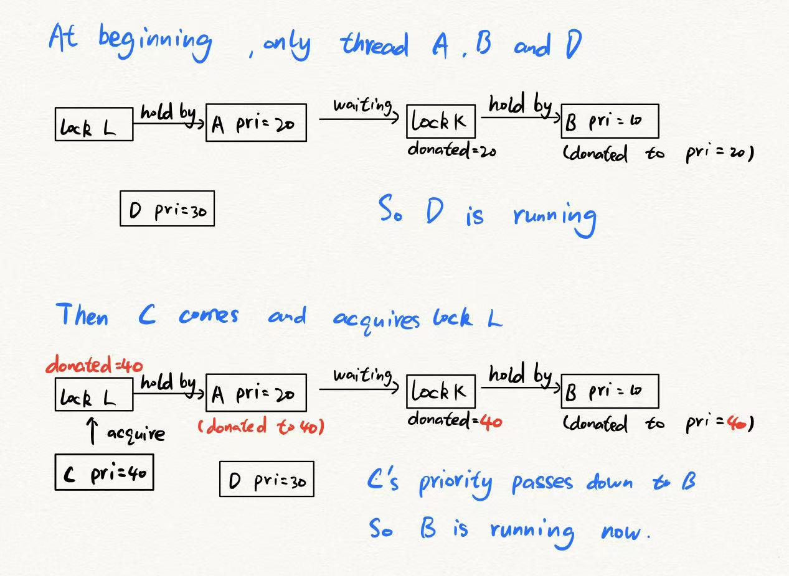

# Project 1: Threads

## Preliminaries

>Fill in your name and email address.

Sun Shaocong <2000012977@stu.pku.edu.cn>

>If you have any preliminary comments on your submission, notes for the
>TAs, please give them here.

None.

>Please cite any offline or online sources you consulted while
>preparing your submission, other than the Pintos documentation, course
>text, lecture notes, and course staff.

None.

## Alarm Clock

#### DATA STRUCTURES

>A1: Copy here the declaration of each new or changed struct or struct member, global or static variable, typedef, or enumeration.  Identify the purpose of each in 25 words or less.

New struct member in struct thread:

    int64_t wake_up_time;            /**< The time to invoke the thread. */

New static variable in timer.c:

    static struct list sleep_queue;  /**< An ordered list for sleeping threads. */

#### ALGORITHMS

>A2: Briefly describe what happens in a call to timer_sleep(),
>including the effects of the timer interrupt handler.

When a thread call timer_sleep(), this function will calculate when to wake up the calling thread and set wake_up_time in caller's thread struct. Then insert this thread into the sleep_queue in the order of wake_up_time.

The timer interrupt handler will check whether any thread needs to be awakened every time it is called. Since the sleep_queue is orderd, we only need to check first few elements. 

By the way, there is a detail about the order of function calls in the while loop inside timer interrupt handler. Notice that the member elem in struct thread isn't used when the thread is put to sleep, we just make this elem as list_elem to insert the thread into the sleep_queue. But when it's need to be awakened, the member elem will be used for the ready_list. So we should pop the sleep_queue before calling thread_unblock().  

>A3: What steps are taken to minimize the amount of time spent in
>the timer interrupt handler?

By keeping the sleep_queue in order. On average, the time complexity of waking up each thread is O(1).

#### SYNCHRONIZATION

>A4: How are race conditions avoided when multiple threads call
>timer_sleep() simultaneously?

In timer_sleep(), interrupt is turned off before modifying the sleep_queue and will be resumed after the thread is awakened.

>A5: How are race conditions avoided when a timer interrupt occurs
>during a call to timer_sleep()?

Since we turn off interrupt before modifying the sleep_queue, a timer interrupt can't occurs between modifying the sleep_queue and blocking the thread. So it won't cause any trouble.

#### RATIONALE

>A6: Why did you choose this design?  In what ways is it superior to
>another design you considered?

This design is easy to implement and its performance is acceptable. Keeping the sleep_queue in order reduces the running time of the timer interrupt handler.

## Priority Scheduling

#### DATA STRUCTURES

>B1: Copy here the declaration of each new or changed struct or struct member, global or static variable, typedef, or enumeration.  Identify the purpose of each in 25 words or less.

New strcut members in struct lock:

    int donated_priority;           /**< Current highest donated priority. */
    struct list_elem elem;          /**< List element. */

New struct members in struct thread:

    struct list holding_lock_list;      /**< List of locks thread holds. */
    struct lock* waiting_lock;          /**< Thread current waiting lock. */

>B2: Explain the data structure used to track priority donation.
>Use ASCII art to diagram a nested donation.  (Alternately, submit a
>.png file.)

Consider a general condition, each thread holds several locks (could be none) and may be waiting for another lock. In a normal working case (no deadlock), threads form a structure similar to a forest through the relationship of locks. So it's a common idea to maintain locks held by the thread in a list (holding_lock_list) and current waiting lock as a pointer (waiting_lock). 

As for a lock holding by someone, it could receive donations from several other threads (or not). But why don't we record all donaters? Instead, we only record the max value of all donated priority as donated_priority. When some donaters donate to this lock holder because of this lock, their prioritise couldn't be lowered before the holder release this lock (The only way to lower a thread's priority is through thread_set_priority(), however, all donaters aren't able to do this because they are being blocked at the lock.). So we only need to record the max value and increase it when necessary.

In general, a thread's real priority is the max value among its own priority and all locks' donated_priority that it holds. A lock's donated_priority is maintained as the max real priority of it's waiters or just PRI_MIN if it doesn't have any waiters.

#### ALGORITHMS

>B3: How do you ensure that the highest priority thread waiting for
>a lock, semaphore, or condition variable wakes up first?

A semaphore scans its waiter list and picks a thread with the highest priority to unblock. Then it compares the highest priority with current thread's priority to decide whether to call thread_yeild().

A lock is based on a semaphore, so we don't need to make additional changes.

A condition variable is a little more complex. It checks all semaphore and selects the highest priority for each semaphore's waiter list. Then it picks a semaphore with the global highest priority to UP.

>B4: Describe the sequence of events when a call to lock_acquire()
>causes a priority donation.  How is nested donation handled?

Firstly, it checks whether the lock is being holded. If not, acquire it and record it in holding_lock_list. Otherwise, we will compare current thread's priority with the lock's donated_priority to decide whether to make a donation through thread_donate_priority(). Donations are only made when necessary. At last, set waiting_lock and call sema_down() to block.
When it comes back form blocking, just record it in holding_lock_list, clean waiting_lock and reset the lock's donated_priority to PRI_MIN.

In thread_donate_priority(), we increase the lock's donated_priority to donater's current priority. To handle nested donation, thread_donate_priority() is made to be a recursive function. It decides whether the receiver should pass the donated priority down recursively.

PS. Here it supposes that we want to schedule by donation. Otherwise, we will use the original version of lock_acquire(). Same for lock_release().

>B5: Describe the sequence of events when lock_release() is called
>on a lock that a higher-priority thread is waiting for.

When the lower_priority thread releases a lock that has been donated, it should return donated priority related to this lock. This is implemented through deleting relevant holding_lock_list node. Then it really releases the lock through sema_up().When control returns to the higher_priority thread, it will reset waiting_lock to NULL and record it in its holding_lock_list, where is the point this donation is finished.

#### SYNCHRONIZATION

>B6: Describe a potential race in thread_set_priority() and explain
>how your implementation avoids it.  Can you use a lock to avoid
>this race?

When thread T is calling thread_set_priority() to set its priority and another thread try to call thread_select_priority(T) to get T's priority, here comes a race. Just disable interrupt when we select a priority could avoid it. It seems to consume more time to use a lock instead of disable intrrupt. So it's unnecessary. Besides, thread_select_priority() could be called inside lock_acquire(). It is a really bad idea to use a lock inside lock_acquire(). So, the answer is no.

#### RATIONALE

>B7: Why did you choose this design?  In what ways is it superior to
>another design you considered?

It is a common idea to maintain the forest struct of threads. But it requires some careful thinking to notice that maintaining only the max value of donated_priority for each lock should be enough. So I think this is a superior. However, if we add a function to let a thread to modify another thread's priority, we will have no choice but to record all the donations relevant to a single lock.

## Advanced Scheduler

#### DATA STRUCTURES

>C1: Copy here the declaration of each new or changed struct or struct member, global or static variable, typedef, or enumeration.  Identify the purpose of each in 25 words or less.

New struct menbers in struct thread:

    int nice;                           /**< Nice. */
    fixed_point recent_cpu;             /**< Recent CPU. */

New static variable:

    static fixed_point load_avg;        /**< Load average. */

#### ALGORITHMS

>C2: How is the way you divided the cost of scheduling between code
>inside and outside interrupt context likely to affect performance?

All the updates are made in the timer interrupts. Schedule() is almost unchanged. Well, it is likely to somehow improve the performance if some updates are made outside the timer interrupt. But it would make our system structure more complex. In this simple case, the performance seems to be acceptable.

#### RATIONALE

>C3: Briefly critique your design, pointing out advantages and
>disadvantages in your design choices.  If you were to have extra
>time to work on this part of the project, how might you choose to
>refine or improve your design?

This solution is no doubt a direct and simple one, but performs well enough for a toy OS system like this. That could be an advantage. However, when we run hundreds or thousands of threads in this system, the scheduler will be incompetent because almost every operation is O(n). To make some improvement, I might introduce some advanced data structures to manage all the threads, for example, heaps, AVLs and Red-Black trees.

>C4: The assignment explains arithmetic for fixed-point math in
>detail, but it leaves it open to you to implement it.  Why did you
>decide to implement it the way you did?  If you created an
>abstraction layer for fixed-point math, that is, an abstract data
>type and/or a set of functions or macros to manipulate fixed-point
>numbers, why did you do so?  If not, why not?

I did create an abstraction layer in fixex-point.h. That includes a defination of data type "fixed_point" and a set of macros to manipulate fixed-point. This allows for more convenient modular design as well as less confusing bugs. By the way, the reason why to choose macros instead of functions is that macros run much more faster than functions and can slightly make up for the deficiency mentioned in C3.